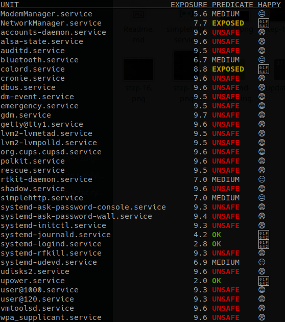

# Systemd Service Hardening

This is a demonstration about the powerful of systemd.
From latest realeases, systemd implemented some interesting features. These features regards security, in particular the sandboxing.
The file `simplehttp.service` provides some of these directives made available by systemd.
The images show, step-by-step, how to harden the service using specific directives and check them with provided systemd tools.


## Debugging

Systemd made available an interesting tool named **systemd-analyze**.

The `systemd-analyze security` command generate a report of the security directives applied to each service present into our machine.



This allow us to check the improvements applied to our systemd service, directive by directive.

As you can see more of the systemd services are actually marked as totally **UNSAFE**.


## Getting Started

Let's start from a basic command to start `python3 -m http.server` as a service:

```[Unit]
Description=Job that runs the python http.server daemon
Documentation=man:SimpleHTTPServer(1)

[Service]
Type=simple
WorkingDirectory=/home/user
ExecStart=/usr/bin/python3 -m http.server
ExecStop=/bin/kill -9 $MAINPID

[Install]
WantedBy=multi-user.target
```

Checking the security analysis through `systemd-analyze security` we obtain the following result:


The security value is actually **9.6**/**10** and is marked as **UNSAFE**.

Let's see now, how to harden the current service to be marked as safe.

N.B. Not all of the following directives are really useful for the current service. It's just a demonstration on how to reduce the exposure of a generic systemd service.

 

### PrivateTmp

Creates a file system namespace under `/tmp/systemd-private-*-[unit name]-*/tmp` rather than a shared `/tmp` or `/var/tmp`. Many of the unit files that ship with Red Hat Enterprise Linux include  this setting and it removes an entire class of vulnerabilities around  the prediction and replacement of files used in `/tmp`.  [4]

This is how the service appear after the insertion of the following directive:

```
Description=Job that runs the python http.server daemon
Documentation=man:SimpleHTTPServer(1)

[Service]
Type=simple
WorkingDirectory=/home/user
ExecStart=/usr/bin/python3 -m http.server
ExecStop=/bin/kill -9 $MAINPID

# Sandboxing features
PrivateTmp=yes

[Install]
WantedBy=multi-user.target
```

The result obtained from `systemd-analyze` is the following:

`simplehttp.service                        9.2 UNSAFE    😨`

Good! We lower down from **9.6** to **9.2**.

Let's see how to improve the final result.


### NoNewPrivileges

Prevents the service and related child processes from escalating privileges. [4]

Add the following row:

```NoNewPrivileges=true```

The result obtainer is now:

```simplehttp.service                        9.0 UNSAFE    😨```


### RestrictNamespaces

Restrict all or a subset of namespaces to the service. Accepts `cgroup`, `ipc`, `net`, `mnt`, `pid`, `user`, and `uts`. [4]

Add the following row:

```RestrictNamespaces=uts ipc pid user cgroup```

As you can see above, the `net` namespace has not been set due to the network work of our service.

Isolating `net` from a network service will cause the uselessness of this.

```simplehttp.service                        8.8 EXPOSED   😨```


### Final results

Once we added the other directives to the service, we obtained a service like this:

```[Unit]
Description=Job that runs the python http.server daemon
Documentation=man:SimpleHTTPServer(1)

[Service]
Type=simple
WorkingDirectory=/home/user
ExecStart=/usr/bin/python3 -m http.server
ExecStop=/bin/kill -9 $MAINPID

# Sandboxing features
PrivateTmp=yes
NoNewPrivileges=true
ProtectSystem=strict
CapabilityBoundingSet=CAP_NET_BIND_SERVICE CAP_DAC_READ_SEARCH
RestrictNamespaces=uts ipc pid user cgroup
ProtectKernelTunables=yes
ProtectKernelModules=yes
ProtectControlGroups=yes
PrivateDevices=yes
RestrictSUIDSGID=true
IPAddressDeny=any

[Install]
WantedBy=multi-user.target
```

Reaching a really interesting result:

```simplehttp.service                        4.9 OK       😃``` 

Well done! We obtained a good result passing from **9.6** to **4.9**, partially securing the entire system.


## References
1. https://lincolnloop.com/blog/sandboxing-services-systemd/
2. https://dev.to/djmoch/hardening-services-with-systemd-2md7
3. https://www.ctrl.blog/entry/systemd-service-hardening.html
4. https://www.redhat.com/sysadmin/mastering-systemd
5. http://man7.org/linux/man-pages/man7/capabilities.7.html